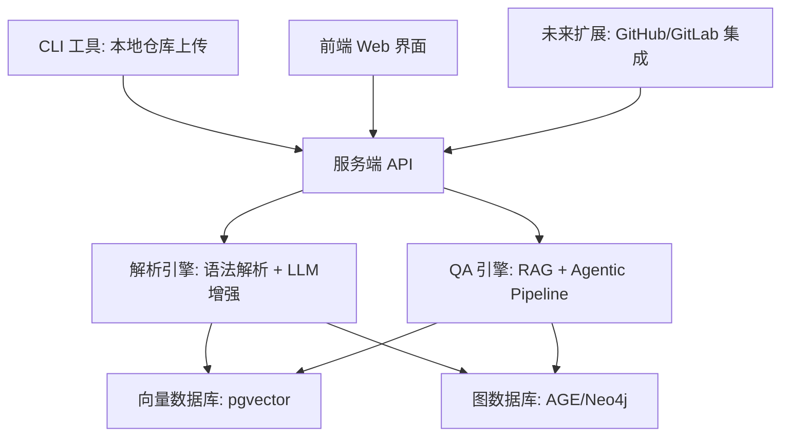

# CodeAtlas

**探索、检索与理解代码库的智能知识图谱平台**

CodeAtlas 是一个结合 **RAG (Retrieval-Augmented Generation)**、**代码知识图谱** 和 **语义检索** 的智能平台，帮助开发者、架构师、运维人员快速理解和导航大型代码库。  
无论是跨文件问答、文档代码对齐，还是复杂依赖分析，CodeAtlas 都能提供精准且上下文感知的答案。

---

## ✨ 功能特性

- **代码/文档语义检索**
  - 支持自然语言查询代码实现、调用关系和业务逻辑
- **代码知识图谱**
  - 基于静态分析和语义解析构建全局代码关系图
  - 支持复杂路径和依赖查询
- **文档与代码对齐**
  - 智能对齐注释、文档和代码，降低理解成本
- **增量仓库更新**
  - 通过 CLI 或 Git API 轻量同步更新
  - 可选 Git 历史追踪，用于演化分析
- **多模态扩展**
  - 支持集成 issue、PR、设计文档等企业内知识源

---

## 🏗 架构概览

---

## 🛠 技术选型

| 模块         | 技术栈/工具             | 说明                   |
| ------------ | ----------------------- | ---------------------- |
| **后端服务** | Go (Gin/Fiber)          | 高性能 API 服务        |
| **解析引擎** | Go + Tree-sitter + LLM  | 代码语法解析 + AI 增强 |
| **向量存储** | PostgreSQL + pgvector   | 语义检索               |
| **图谱存储** | PostgreSQL AGE          | 依赖关系、路径查询     |
| **前端界面** | Svelte + Rsbuild        | 轻量现代前端框架       |
| **容器化**   | Docker + Docker Compose | 本地和生产环境一致     |
| **CLI 工具** | Go                      | 轻量跨平台同步工具     |

---

## 📂 模块设计

| 模块           | 说明                                   |
| -------------- | -------------------------------------- |
| **CLI 工具**   | 将本地仓库结构和 Git 信息同步到服务端  |
| **解析引擎**   | 对代码进行语法解析、语义增强和向量化   |
| **图谱服务**   | 构建与维护仓库级知识图谱               |
| **检索与问答** | 基于向量检索 + 图谱推理的智能 RAG 引擎 |
| **Web 前端**   | 可视化代码导航、图谱查询与问答界面     |

---

## 🧭 路线图

### **Phase 1 - 基础录入与查询**

- [ ] CLI 上传文件与 Git 基础信息
- [ ] 服务端解析与入库
- [ ] 基础语义检索和问答

### **Phase 2 - 知识图谱增强**

- [ ] 基于 Tree-sitter 构建精准依赖图
- [ ] 增强跨文件 QA 能力
- [ ] 增加简单的图谱可视化界面

### **Phase 3 - 企业集成**

- [ ] GitHub/GitLab Webhook 支持
- [ ] PR/Issue 语义检索
- [ ] 项目级多仓库聚合

### **Phase 4 - 高级智能**

- [ ] 增加 Agentic RAG 流程
- [ ] 智能路径推理与多跳问答
- [ ] 企业内知识多模态扩展

---

## 📚 参考资料

- **论文**

  - [Knowledge Graph Based Repository-Level Code Generation (2025)](https://aclanthology.org/2025.naacl-long.7.pdf)
  - [KGRAG-Ex (2025)](https://aclanthology.org/2025.naacl-long.449.pdf)
  - [CODEXGRAPH (2025)](https://arxiv.org/pdf/2505.14394v1)
  - [Agentic RAG Foundations (2025)](https://arxiv.org/pdf/2508.06401)
  - [Graph-enhanced RAG Techniques (2025)](https://arxiv.org/pdf/2508.05509)
  - [Advanced Multi-hop Code Reasoning (2025)](https://arxiv.org/pdf/2508.06105)

- **项目**

  - [DeepWiki-Open](https://github.com/deepwiki-open)
  - [GraphRAG](https://github.com)
  - [AgenticRAG](https://github.com/realyinchen/AgenticRAG)

---

## 📜 许可证

[MIT License](./LICENSE)
