# CodeAtlas

**探索、检索与理解代码库的智能知识图谱平台**

CodeAtlas 是一个结合 **RAG (Retrieval-Augmented Generation)**、**代码知识图谱** 和 **语义检索** 的智能平台，帮助开发者、架构师、运维人员快速理解和导航大型代码库。  
无论是跨文件问答、文档代码对齐，还是复杂依赖分析，CodeAtlas 都能提供精准且上下文感知的答案。

---

## ✨ 功能特性

- **代码/文档语义检索**
  - 支持自然语言查询代码实现、调用关系和业务逻辑
- **代码知识图谱**
  - 基于静态分析和语义解析构建全局代码关系图
  - 支持复杂路径和依赖查询
- **文档与代码对齐**
  - 智能对齐注释、文档和代码，降低理解成本
- **增量仓库更新**
  - 通过 CLI 或 Git API 轻量同步更新
  - 可选 Git 历史追踪，用于演化分析
- **多模态扩展**
  - 支持集成 issue、PR、设计文档等企业内知识源
- **多语言支持**
  - 支持 Go, JavaScript/TypeScript, Python
  - 支持移动开发语言：Kotlin, Java, Swift, Objective-C
  - 支持原生代码：C, C++
  - 智能头文件-实现文件关联（C/C++/Objective-C）

---

## 🏗 架构概览

```mermaid
flowchart TD
    CLI[CLI 工具: 本地仓库上传] --> API[服务端 API]
    API --> Parser[解析引擎: 语法解析 + LLM增强]
    Parser --> VectorDB[向量数据库: pgvector]
    Parser --> GraphDB[图数据库: AGE/Neo4j]
    API --> QAEngine[QA 引擎: RAG + Agentic Pipeline]
    QAEngine --> VectorDB
    QAEngine --> GraphDB
    UI[前端 Web 界面] --> API
    Notes[未来扩展: GitHub/GitLab 集成] --> API
```



---

## 🛠 技术选型

| 模块         | 技术栈/工具             | 说明                   |
| ------------ | ----------------------- | ---------------------- |
| **后端服务** | Go (Gin/Fiber)          | 高性能 API 服务        |
| **解析引擎** | Go + Tree-sitter + LLM  | 代码语法解析 + AI 增强 |
| **向量存储** | PostgreSQL + pgvector   | 语义检索               |
| **图谱存储** | PostgreSQL AGE          | 依赖关系、路径查询     |
| **前端界面** | Svelte + Rsbuild        | 轻量现代前端框架       |
| **容器化**   | Docker + Docker Compose | 本地和生产环境一致     |
| **CLI 工具** | Go                      | 轻量跨平台同步工具     |

---

## 📂 模块设计

| 模块           | 说明                                   |
| -------------- | -------------------------------------- |
| **CLI 工具**   | 将本地仓库结构和 Git 信息同步到服务端  |
| **解析引擎**   | 对代码进行语法解析、语义增强和向量化   |
| **图谱服务**   | 构建与维护仓库级知识图谱               |
| **检索与问答** | 基于向量检索 + 图谱推理的智能 RAG 引擎 |
| **Web 前端**   | 可视化代码导航、图谱查询与问答界面     |

---

## 🚀 快速开始

### 三种启动方式

#### 方式 1: DevContainer（推荐）⭐

最简单的方式，开箱即用的完整开发环境。

**VS Code:**
1. 安装 [Dev Containers 扩展](https://marketplace.visualstudio.com/items?itemName=ms-vscode-remote.remote-containers)
2. 打开项目，点击 "Reopen in Container"
3. 等待容器构建完成（首次约 3-5 分钟）

**GitHub Codespaces:**
- 点击 "Code" → "Codespaces" → "Create codespace"

详细文档：**[DevContainer 开发指南](docs/development/devcontainer.md)**

#### 方式 2: Docker Compose

适合快速测试和演示。

```bash
# 启动所有服务
docker-compose up -d

# 检查服务状态
docker-compose ps
```

服务地址：
- API: http://localhost:8080
- 数据库: localhost:5432

#### 方式 3: 本地开发

适合需要完全控制的开发场景。

```bash
# 启动数据库
make db

# 初始化数据库
make db-init

# 运行 API 服务
make run-api

# 运行前端（另一个终端）
cd web
pnpm install
pnpm dev
```

### 第一次使用

```bash
# 1. 验证安装
curl http://localhost:8080/health

# 2. 解析代码仓库
make build-cli
./bin/cli parse --path /path/to/your/repo --output result.json

# 3. 索引到知识图谱
./bin/cli index --path /path/to/your/repo --api-url http://localhost:8080

# 4. 查询代码
curl http://localhost:8080/api/v1/repositories
```

### 完整文档

- **[快速开始指南](docs/getting-started/quick-start.md)** - 5 分钟快速上手
- **[CLI 工具指南](docs/user-guide/cli/README.md)** - Parse 和 Index 命令完整文档
- **[API 使用指南](docs/user-guide/api/README.md)** - HTTP API 完整参考
- **[配置指南](docs/configuration/README.md)** - 所有配置选项说明
- **[部署指南](docs/deployment/README.md)** - 生产环境部署
- **[开发指南](docs/development/testing.md)** - 测试和开发最佳实践

---

## 🧭 路线图

### **Phase 1 - 基础录入与查询**

- [x] CLI 上传文件与 Git 基础信息
- [x] 服务端解析与入库
- [x] 多语言解析支持（Go, JS/TS, Python, Kotlin, Java, Swift, Objective-C, C, C++）
- [ ] 基础语义检索和问答

### **Phase 2 - 知识图谱增强**

- [ ] 基于 Tree-sitter 构建精准依赖图
- [ ] 增强跨文件 QA 能力
- [ ] 增加简单的图谱可视化界面

### **Phase 3 - 企业集成**

- [ ] GitHub/GitLab Webhook 支持
- [ ] PR/Issue 语义检索
- [ ] 项目级多仓库聚合

### **Phase 4 - 高级智能**

- [ ] 增加 Agentic RAG 流程
- [ ] 智能路径推理与多跳问答
- [ ] 企业内知识多模态扩展

---

## 📚 参考资料

- **论文**

  - [Knowledge Graph Based Repository-Level Code Generation (2025)](https://aclanthology.org/2025.naacl-long.7.pdf)
  - [KGRAG-Ex (2025)](https://aclanthology.org/2025.naacl-long.449.pdf)
  - [CODEXGRAPH (2025)](https://arxiv.org/pdf/2505.14394v1)
  - [Agentic RAG Foundations (2025)](https://arxiv.org/pdf/2508.06401)
  - [Graph-enhanced RAG Techniques (2025)](https://arxiv.org/pdf/2508.05509)
  - [Advanced Multi-hop Code Reasoning (2025)](https://arxiv.org/pdf/2508.06105)

- **项目**

  - [DeepWiki-Open](https://github.com/deepwiki-open)
  - [GraphRAG](https://github.com)
  - [AgenticRAG](https://github.com/realyinchen/AgenticRAG)

---

## 📜 许可证

[MIT License](./LICENSE)
