# CodeAtlas

**探索、检索与理解代码库的智能知识图谱平台**

CodeAtlas 是一个结合 **RAG (Retrieval-Augmented Generation)**、**代码知识图谱** 和 **语义检索** 的智能平台，帮助开发者、架构师、运维人员快速理解和导航大型代码库。  
无论是跨文件问答、文档代码对齐，还是复杂依赖分析，CodeAtlas 都能提供精准且上下文感知的答案。

---

## ✨ 功能特性

- **代码/文档语义检索**
  - 支持自然语言查询代码实现、调用关系和业务逻辑
- **代码知识图谱**
  - 基于静态分析和语义解析构建全局代码关系图
  - 支持复杂路径和依赖查询
- **文档与代码对齐**
  - 智能对齐注释、文档和代码，降低理解成本
- **增量仓库更新**
  - 通过 CLI 或 Git API 轻量同步更新
  - 可选 Git 历史追踪，用于演化分析
- **多模态扩展**
  - 支持集成 issue、PR、设计文档等企业内知识源

---

## 🏗 架构概览

```mermaid
flowchart TD
    CLI[CLI 工具: 本地仓库上传] --> API[服务端 API]
    API --> Parser[解析引擎: 语法解析 + LLM增强]
    Parser --> VectorDB[向量数据库: pgvector]
    Parser --> GraphDB[图数据库: AGE/Neo4j]
    API --> QAEngine[QA 引擎: RAG + Agentic Pipeline]
    QAEngine --> VectorDB
    QAEngine --> GraphDB
    UI[前端 Web 界面] --> API
    Notes[未来扩展: GitHub/GitLab 集成] --> API
```



---

## 🛠 技术选型

| 模块         | 技术栈/工具             | 说明                   |
| ------------ | ----------------------- | ---------------------- |
| **后端服务** | Go (Gin/Fiber)          | 高性能 API 服务        |
| **解析引擎** | Go + Tree-sitter + LLM  | 代码语法解析 + AI 增强 |
| **向量存储** | PostgreSQL + pgvector   | 语义检索               |
| **图谱存储** | PostgreSQL AGE          | 依赖关系、路径查询     |
| **前端界面** | Svelte + Rsbuild        | 轻量现代前端框架       |
| **容器化**   | Docker + Docker Compose | 本地和生产环境一致     |
| **CLI 工具** | Go                      | 轻量跨平台同步工具     |

---

## 📂 模块设计

| 模块           | 说明                                   |
| -------------- | -------------------------------------- |
| **CLI 工具**   | 将本地仓库结构和 Git 信息同步到服务端  |
| **解析引擎**   | 对代码进行语法解析、语义增强和向量化   |
| **图谱服务**   | 构建与维护仓库级知识图谱               |
| **检索与问答** | 基于向量检索 + 图谱推理的智能 RAG 引擎 |
| **Web 前端**   | 可视化代码导航、图谱查询与问答界面     |

---

## 🚀 快速开始

### 项目结构

```
.
├── cmd/
│   ├── api/          # API 服务端入口
│   └── cli/          # CLI 工具入口
├── internal/
│   ├── api/          # API 服务实现
│   ├── parser/       # 代码解析引擎
│   ├── graph/        # 知识图谱服务
│   ├── retrieval/    # 向量检索服务
│   └── qa/           # QA 引擎实现
├── pkg/
│   ├── models/       # 数据模型
│   └── utils/        # 工具函数
├── web/              # Svelte 前端
│   ├── src/
│   └── public/
├── docker/           # Docker 相关文件
├── deployments/      # 部署文件
├── configs/          # 配置文件
├── scripts/          # 开发脚本
├── docs/             # 文档
├── tests/            # 测试
├── go.mod            # Go 模块定义
├── go.sum            # Go 依赖
├── package.json      # 前端依赖
├── docker-compose.yml # 开发环境
└── README.md         # 项目文档
```

### 运行开发环境

1. 启动数据库和后端服务：
```bash
docker-compose up -d
```

2. 运行 API 服务：
```bash
cd cmd/api
go run main.go
```

3. 运行 CLI 工具：
```bash
cd cmd/cli
go run main.go upload -p /path/to/repo -s http://localhost:8080
```

4. 运行前端：
```bash
cd web
npm install
npm run dev
```

### CLI 工具使用

#### Parse 命令 - 代码解析

`parse` 命令用于分析源代码并输出结构化的 JSON AST 表示。支持 Go、JavaScript/TypeScript 和 Python。

**基本用法：**

```bash
# 解析整个仓库
codeatlas parse --path /path/to/repository

# 解析单个文件
codeatlas parse --file /path/to/file.go

# 保存输出到文件
codeatlas parse --path /path/to/repository --output result.json

# 只解析特定语言
codeatlas parse --path /path/to/repository --language go

# 使用多个并发工作线程
codeatlas parse --path /path/to/repository --workers 8

# 启用详细日志
codeatlas parse --path /path/to/repository --verbose
```

**常用选项：**

| 选项 | 说明 | 示例 |
|------|------|------|
| `--path`, `-p` | 仓库或目录路径 | `--path ./myproject` |
| `--file`, `-f` | 单个文件路径 | `--file main.go` |
| `--output`, `-o` | 输出文件路径 | `--output result.json` |
| `--language`, `-l` | 按语言过滤 | `--language go` |
| `--workers`, `-w` | 并发工作线程数 | `--workers 4` |
| `--verbose`, `-v` | 详细日志 | `--verbose` |
| `--ignore-pattern` | 忽略模式 | `--ignore-pattern "*.test.js"` |
| `--no-ignore` | 禁用所有忽略规则 | `--no-ignore` |

**详细文档：**
- [CLI Parse 命令完整文档](./docs/cli/cli-parse-command.md) - 完整的命令参考和使用指南
- [快速参考](./docs/cli/parse-command-quick-reference.md) - 常用命令速查
- [故障排除指南](./docs/cli/parse-troubleshooting.md) - 常见问题解决方案
- [环境变量配置](./docs/cli/parse-environment-variables.md) - 环境变量说明
- [性能优化指南](./docs/testing/performance.md) - 性能调优和基准测试
- [性能验证结果](./docs/testing/performance-validation-results.md) - 性能测试结果
- [输出示例](./docs/examples/parse-output-example.json) - JSON 输出格式示例

#### Upload 命令 - 上传到服务器

```bash
codeatlas upload -p /path/to/repo -s http://localhost:8080
```

### 测试与代码覆盖率

运行测试：
```bash
# 运行所有测试
make test

# 运行特定模块测试
make test-api
make test-cli
make test-models

# 生成测试覆盖率报告
make test-coverage

# 查看函数级覆盖率统计
make test-coverage-func

# 使用高级覆盖率分析脚本
./scripts/coverage.sh all
```

详细的测试和覆盖率指南请参考 [测试覆盖率文档](./docs/testing-coverage.md)。

---

## 🧭 路线图

### **Phase 1 - 基础录入与查询**

- [x] CLI 上传文件与 Git 基础信息
- [x] 服务端解析与入库
- [ ] 基础语义检索和问答

### **Phase 2 - 知识图谱增强**

- [ ] 基于 Tree-sitter 构建精准依赖图
- [ ] 增强跨文件 QA 能力
- [ ] 增加简单的图谱可视化界面

### **Phase 3 - 企业集成**

- [ ] GitHub/GitLab Webhook 支持
- [ ] PR/Issue 语义检索
- [ ] 项目级多仓库聚合

### **Phase 4 - 高级智能**

- [ ] 增加 Agentic RAG 流程
- [ ] 智能路径推理与多跳问答
- [ ] 企业内知识多模态扩展

---

## 📚 参考资料

- **论文**

  - [Knowledge Graph Based Repository-Level Code Generation (2025)](https://aclanthology.org/2025.naacl-long.7.pdf)
  - [KGRAG-Ex (2025)](https://aclanthology.org/2025.naacl-long.449.pdf)
  - [CODEXGRAPH (2025)](https://arxiv.org/pdf/2505.14394v1)
  - [Agentic RAG Foundations (2025)](https://arxiv.org/pdf/2508.06401)
  - [Graph-enhanced RAG Techniques (2025)](https://arxiv.org/pdf/2508.05509)
  - [Advanced Multi-hop Code Reasoning (2025)](https://arxiv.org/pdf/2508.06105)

- **项目**

  - [DeepWiki-Open](https://github.com/deepwiki-open)
  - [GraphRAG](https://github.com)
  - [AgenticRAG](https://github.com/realyinchen/AgenticRAG)

---

## 📜 许可证

[MIT License](./LICENSE)
