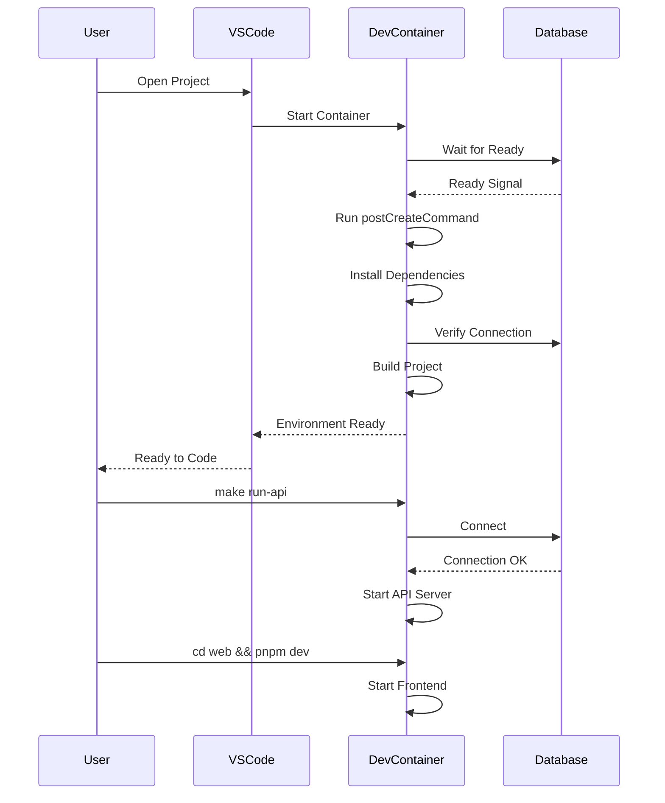
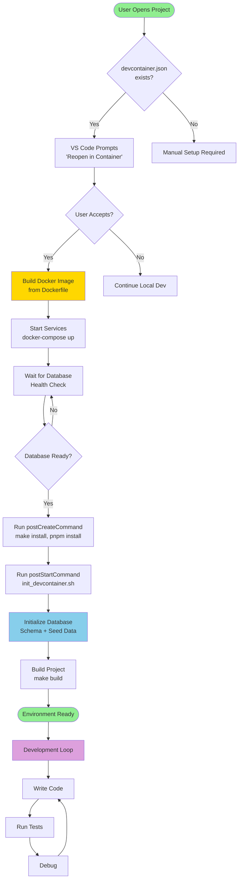
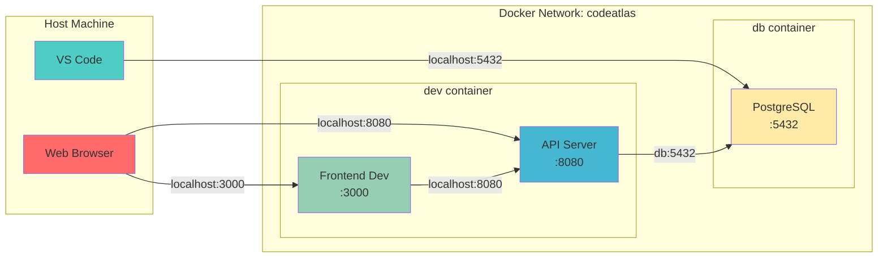
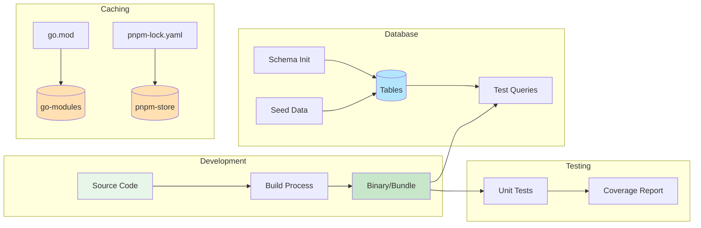

# DevContainer 架构说明

## 整体架构

```mermaid
graph TB
    subgraph "VS Code / Codespaces"
        VSCode[VS Code Editor]
        Extensions[Extensions<br/>Go, Svelte, Docker, PostgreSQL]
    end
    
    subgraph "DevContainer Environment"
        subgraph "Development Container"
            GoTools[Go 1.25<br/>gopls, delve, golangci-lint]
            NodeTools[Node.js 20<br/>pnpm]
            SystemTools[System Tools<br/>git, curl, psql]
            Workspace[/workspace<br/>Project Files]
        end
        
        subgraph "Database Container"
            PostgreSQL[PostgreSQL 17<br/>pgvector + AGE]
            InitScripts[Init Scripts<br/>Schema + Seed Data]
            DBData[(Database Data)]
        end
        
        subgraph "Named Volumes"
            GoModules[(go-modules)]
            PnpmStore[(pnpm-store)]
            PostgresData[(postgres-data)]
        end
    end
    
    VSCode --> |Remote Connection| GoTools
    VSCode --> |Remote Connection| NodeTools
    Extensions --> |Database Client| PostgreSQL
    
    GoTools --> |Build & Test| Workspace
    NodeTools --> |Frontend Dev| Workspace
    
    GoTools --> |Cache| GoModules
    NodeTools --> |Cache| PnpmStore
    
    PostgreSQL --> |Persist| PostgresData
    InitScripts --> |Initialize| PostgreSQL
    
    Workspace --> |API Calls| PostgreSQL
    
    style VSCode fill:#007ACC
    style PostgreSQL fill:#336791
    style GoTools fill:#00ADD8
    style NodeTools fill:#339933
```

## 容器通信



## 文件系统布局

```
Host Machine
│
├── Project Directory (mounted as /workspace)
│   ├── .devcontainer/
│   │   ├── Dockerfile              → Build dev container image
│   │   ├── devcontainer.json       → VS Code configuration
│   │   └── docker-compose.yml      → Service orchestration
│   │
│   ├── scripts/
│   │   ├── init_devcontainer.sh    → Post-start initialization
│   │   ├── seed_data.sql           → Test data
│   │   └── test_devcontainer.sh    → Environment validation
│   │
│   └── [source code]
│
└── Docker Volumes (persistent)
    ├── go-modules                   → Go dependency cache
    ├── pnpm-store                   → pnpm package cache
    └── postgres-data                → Database files
```

## 启动流程



## 网络架构



## 数据流



## 扩展点

### 1. 添加新服务

编辑 `.devcontainer/docker-compose.yml`:
```yaml
services:
  dev:
    # ... existing config
  
  db:
    # ... existing config
  
  redis:  # 新服务
    image: redis:7-alpine
    ports:
      - "6379:6379"
```

### 2. 添加新工具

编辑 `.devcontainer/Dockerfile`:
```dockerfile
# Install additional tools
RUN apt-get update && apt-get install -y \
    your-tool \
    && apt-get clean
```

### 3. 自定义初始化

编辑 `scripts/init_devcontainer.sh`:
```bash
# Add custom initialization steps
echo "Running custom setup..."
# Your commands here
```

### 4. 修改测试数据

编辑 `scripts/seed_data.sql`:
```sql
-- Add more test data
INSERT INTO repositories (...) VALUES (...);
```

## 性能优化

### 缓存策略

1. **Go Modules**: 使用命名卷 `go-modules`
   - 避免每次重新下载依赖
   - 跨容器重建共享

2. **pnpm Store**: 使用命名卷 `pnpm-store`
   - 内容寻址存储
   - 节省磁盘空间

3. **Database Data**: 使用命名卷 `postgres-data`
   - 数据持久化
   - 避免重新初始化

### 构建优化

1. **多阶段构建**: Dockerfile 使用基础镜像
2. **层缓存**: 合理安排 Dockerfile 指令顺序
3. **并行安装**: postCreateCommand 并行执行

## 安全考虑

### 开发环境
- ✅ 使用非 root 用户（vscode）
- ✅ 开发密码（不用于生产）
- ✅ 网络隔离（Docker 网络）
- ✅ 卷权限控制

### 生产环境差异
- ❌ 不要在生产使用开发密码
- ❌ 不要暴露所有端口
- ❌ 需要添加 TLS/SSL
- ❌ 需要添加认证和授权

## 故障恢复

### 场景 1: 容器无法启动
```bash
# 查看日志
docker-compose -f .devcontainer/docker-compose.yml logs

# 重建
make devcontainer-clean
make devcontainer-build
```

### 场景 2: 数据库连接失败
```bash
# 检查健康状态
docker-compose -f .devcontainer/docker-compose.yml ps

# 重启数据库
docker-compose -f .devcontainer/docker-compose.yml restart db
```

### 场景 3: 缓存问题
```bash
# 清理所有卷
make devcontainer-clean

# 重新构建
make devcontainer-build
make devcontainer-up
```

## 监控和调试

### 查看容器状态
```bash
docker-compose -f .devcontainer/docker-compose.yml ps
```

### 查看日志
```bash
# 所有服务
make devcontainer-logs

# 特定服务
docker-compose -f .devcontainer/docker-compose.yml logs db
docker-compose -f .devcontainer/docker-compose.yml logs dev
```

### 进入容器
```bash
# 开发容器
docker exec -it codeatlas-dev-1 bash

# 数据库容器
docker exec -it codeatlas-db-1 bash
```

### 资源使用
```bash
docker stats
```

## 最佳实践

1. **定期更新**: 保持基础镜像和工具最新
2. **文档同步**: 修改配置时更新文档
3. **测试验证**: 使用 `test_devcontainer.sh` 验证
4. **版本控制**: 提交所有配置文件
5. **清理资源**: 定期运行 `make devcontainer-clean`

## 参考资源

- [VS Code Dev Containers](https://code.visualstudio.com/docs/devcontainers/containers)
- [Docker Compose](https://docs.docker.com/compose/)
- [PostgreSQL Docker](https://hub.docker.com/_/postgres)
- [Go Docker](https://hub.docker.com/_/golang)
