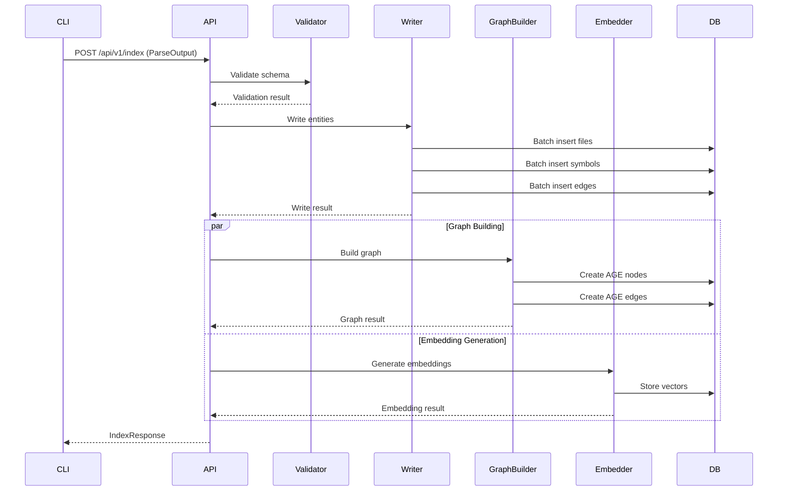

# Architecture Overview

Detailed architecture documentation for the Knowledge Graph Indexer.

## Table of Contents

- [System Architecture](#system-architecture)
- [Component Details](#component-details)
- [Data Flow](#data-flow)
- [Storage Architecture](#storage-architecture)
- [Deployment Architecture](#deployment-architecture)
- [Design Decisions](#design-decisions)

## System Architecture

### High-Level Architecture

```
┌─────────────────────────────────────────────────────────────────┐
│                         Client Layer                            │
│  ┌──────────────┐  ┌──────────────┐  ┌──────────────┐         │
│  │  CLI Tool    │  │  Web Client  │  │  API Client  │         │
│  └──────┬───────┘  └──────┬───────┘  └──────┬───────┘         │
└─────────┼──────────────────┼──────────────────┼─────────────────┘
          │                  │                  │
          └──────────────────┴──────────────────┘
                             │ HTTP/JSON
┌─────────────────────────────────────────────────────────────────┐
│                         API Layer                               │
│  ┌──────────────────────────────────────────────────────────┐  │
│  │                    API Server (Gin)                      │  │
│  │  ┌────────────────────────────────────────────────────┐ │  │
│  │  │              Middleware Stack                      │ │  │
│  │  │  • Recovery  • Logging  • CORS  • Authentication  │ │  │
│  │  └────────────────────────────────────────────────────┘ │  │
│  │                                                          │  │
│  │  ┌────────────────────────────────────────────────────┐ │  │
│  │  │                   Handlers                         │ │  │
│  │  │  • Index  • Search  • Relationships  • Repository │ │  │
│  │  └────────────────────────────────────────────────────┘ │  │
│  └──────────────────────────────────────────────────────────┘  │
└─────────────────────────────────────────────────────────────────┘
                             │
┌─────────────────────────────────────────────────────────────────┐
│                      Processing Layer                           │
│  ┌──────────────────────────────────────────────────────────┐  │
│  │              Indexer Orchestrator                        │  │
│  │  • Validation  • Batch Processing  • Error Handling     │  │
│  └──────────────────────────────────────────────────────────┘  │
│         │                  │                  │                 │
│  ┌──────▼──────┐  ┌───────▼────────┐  ┌─────▼──────┐         │
│  │   Writer    │  │ Graph Builder  │  │  Embedder  │         │
│  │  (Batch)    │  │   (AGE)        │  │  (Vector)  │         │
│  └─────────────┘  └────────────────┘  └────────────┘         │
└─────────────────────────────────────────────────────────────────┘
                             │
┌─────────────────────────────────────────────────────────────────┐
│                       Storage Layer                             │
│  ┌──────────────────────────────────────────────────────────┐  │
│  │                  PostgreSQL 17                           │  │
│  │  ┌────────────┐  ┌────────────┐  ┌────────────┐        │  │
│  │  │ Relational │  │    AGE     │  │  pgvector  │        │  │
│  │  │   Tables   │  │   Graph    │  │  Vectors   │        │  │
│  │  └────────────┘  └────────────┘  └────────────┘        │  │
│  └──────────────────────────────────────────────────────────┘  │
└─────────────────────────────────────────────────────────────────┘
```

### Component Interaction



## Component Details

### 1. API Server

**Technology**: Gin web framework (Go)

**Responsibilities**:
- HTTP request handling
- Authentication and authorization
- Request validation
- Response formatting
- Error handling

**Key Files**:
- `internal/api/server.go` - Server setup and routing
- `internal/api/handlers/` - Request handlers
- `internal/api/middleware/` - Middleware components

**Endpoints**:
```
POST   /api/v1/index                    # Index repository
GET    /api/v1/repositories             # List repositories
GET    /api/v1/repositories/:id         # Get repository
POST   /api/v1/search                   # Semantic search
GET    /api/v1/symbols/:id/callers      # Get callers
GET    /api/v1/symbols/:id/callees      # Get callees
GET    /api/v1/symbols/:id/dependencies # Get dependencies
GET    /api/v1/files/:id/symbols        # Get file symbols
GET    /health                          # Health check
```

### 2. Schema Validator

**Responsibilities**:
- Validate ParseOutput structure
- Check required fields
- Verify referential integrity
- Validate data types

**Key Files**:
- `internal/indexer/validator.go`

**Validation Rules**:
- Files must have: file_id, path, language, checksum
- Symbols must have: symbol_id, file_id, name, kind
- Edges must reference valid symbol_ids
- Spans must have valid line/byte ranges

### 3. Database Writer

**Technology**: PostgreSQL with lib/pq driver

**Responsibilities**:
- Batch insert operations
- Transaction management
- Conflict resolution (ON CONFLICT)
- Retry logic with exponential backoff

**Key Files**:
- `internal/indexer/writer.go`
- `pkg/models/` - Data models and CRUD operations

**Optimization Techniques**:
- Prepared statements
- Batch inserts (100-500 entities per batch)
- Connection pooling
- Transaction boundaries per batch

**Tables Written**:
```
repositories → files → symbols → ast_nodes
                    ↓
                  edges
```

### 4. Graph Builder

**Technology**: Apache AGE (PostgreSQL extension)

**Responsibilities**:
- Create graph nodes from symbols
- Create graph edges from relationships
- Map symbol kinds to node labels
- Map edge types to relationship types

**Key Files**:
- `internal/indexer/graph_builder.go`

**Node Labels**:
- `:Function` - Functions and methods
- `:Class` - Classes and structs
- `:Interface` - Interfaces and protocols
- `:Variable` - Variables and constants
- `:Module` - Modules and packages

**Relationship Types**:
- `:CALLS` - Function calls
- `:IMPORTS` - Module imports
- `:EXTENDS` - Class inheritance
- `:IMPLEMENTS` - Interface implementation
- `:REFERENCES` - General references

**Graph Schema**:
```cypher
// Example node
(:Function {
  symbol_id: "uuid",
  name: "AuthenticateUser",
  signature: "func AuthenticateUser(...)",
  file_path: "internal/auth/auth.go",
  start_line: 10,
  end_line: 25
})

// Example edge
(:Function)-[:CALLS {
  source_file: "internal/api/handler.go",
  line_number: 42
}]->(:Function)
```

### 5. Vector Embedder

**Technology**: OpenAI-compatible API (local or cloud)

**Responsibilities**:
- Generate semantic embeddings
- Batch API requests
- Rate limiting
- Retry logic
- Store vectors in pgvector

**Key Files**:
- `internal/indexer/embedder.go`

**Supported Backends**:
- OpenAI API (text-embedding-3-small/large)
- Local models via LM Studio
- Local models via vLLM
- Custom OpenAI-compatible endpoints

**Embedding Strategy**:
```
Function → signature + docstring + body_preview
Class    → declaration + docstring + method_signatures
Module   → docstring + top_level_declarations
```

**Configuration**:
```bash
EMBEDDING_API_ENDPOINT=http://localhost:1234/v1/embeddings
EMBEDDING_MODEL=text-embedding-qwen3-embedding-0.6b
EMBEDDING_DIMENSIONS=768
EMBEDDING_BATCH_SIZE=50
EMBEDDING_MAX_REQUESTS_PER_SECOND=10
```

### 6. Indexer Orchestrator

**Responsibilities**:
- Coordinate indexing pipeline
- Parallel processing
- Progress tracking
- Error collection
- Result summarization

**Key Files**:
- `internal/indexer/indexer.go`

**Pipeline Stages**:
1. Validation
2. Repository creation/update
3. File batch processing
4. Symbol batch processing
5. Edge batch processing
6. Graph building (async)
7. Embedding generation (async)

**Parallelization**:
- Configurable worker count (default: 4)
- Worker pool for concurrent processing
- Batch-level parallelism
- Independent graph and embedding stages

## Data Flow

### Indexing Flow

```
┌─────────────┐
│ Parse Code  │
└──────┬──────┘
       │ ParseOutput (JSON)
       ↓
┌─────────────┐
│  Validate   │
└──────┬──────┘
       │ Validated entities
       ↓
┌─────────────┐
│Write to DB  │ ← Transaction boundary
│ • Files     │
│ • Symbols   │
│ • Edges     │
└──────┬──────┘
       │
       ├─────────────────┬─────────────────┐
       ↓                 ↓                 ↓
┌─────────────┐   ┌─────────────┐   ┌─────────────┐
│Build Graph  │   │  Generate   │   │   Return    │
│ • Nodes     │   │ Embeddings  │   │   Result    │
│ • Edges     │   │ • Batch API │   │             │
└─────────────┘   └─────────────┘   └─────────────┘
```

### Query Flow

```
┌─────────────┐
│Search Query │
└──────┬──────┘
       │ Natural language
       ↓
┌─────────────┐
│  Generate   │
│  Embedding  │
└──────┬──────┘
       │ Vector
       ↓
┌─────────────┐
│  pgvector   │
│   Search    │
└──────┬──────┘
       │ Similar symbols
       ↓
┌─────────────┐
│   Return    │
│   Results   │
└─────────────┘
```

### Relationship Query Flow

```
┌─────────────┐
│ Symbol ID   │
└──────┬──────┘
       │
       ↓
┌─────────────┐
│   Cypher    │
│   Query     │
└──────┬──────┘
       │ Graph traversal
       ↓
┌─────────────┐
│     AGE     │
│    Graph    │
└──────┬──────┘
       │ Related symbols
       ↓
┌─────────────┐
│   Return    │
│   Results   │
└─────────────┘
```

## Storage Architecture

### PostgreSQL Schema

```
repositories (1) ──< (N) files (1) ──< (N) symbols
                                              │
                                              ├──< (N) ast_nodes
                                              │
                                              └──< (N) edges
                                                      │
                                                      └──> (1) symbols (target)

symbols (1) ──< (N) vectors
symbols (1) ──< (N) docstrings
symbols (1) ──< (N) summaries
```

### Table Sizes (Approximate)

| Table | Rows per 1000 Files | Size per 1000 Files |
|-------|---------------------|---------------------|
| files | 1,000 | ~1 MB |
| symbols | 10,000 | ~10 MB |
| ast_nodes | 50,000 | ~50 MB |
| edges | 30,000 | ~15 MB |
| vectors | 10,000 | ~30 MB (768 dims) |

### Index Strategy

**Primary Indexes**:
- Primary keys on all tables (UUID)
- Foreign key indexes (file_id, symbol_id, repo_id)

**Query Optimization Indexes**:
```sql
-- File lookups
CREATE INDEX idx_files_repo ON files(repo_id);
CREATE INDEX idx_files_checksum ON files(checksum);

-- Symbol lookups
CREATE INDEX idx_symbols_file ON symbols(file_id);
CREATE INDEX idx_symbols_name ON symbols(name);
CREATE INDEX idx_symbols_kind ON symbols(kind);

-- Edge traversal
CREATE INDEX idx_edges_source ON edges(source_id);
CREATE INDEX idx_edges_target ON edges(target_id);
CREATE INDEX idx_edges_type ON edges(edge_type);

-- Vector similarity
CREATE INDEX idx_vectors_embedding ON vectors 
  USING ivfflat (embedding vector_cosine_ops);
```

## Deployment Architecture

### Development Environment

```
┌─────────────────────────────────────────┐
│         Developer Machine               │
│  ┌────────────┐      ┌────────────┐    │
│  │  CLI Tool  │      │ API Server │    │
│  │  (local)   │      │  (local)   │    │
│  └────────────┘      └────────────┘    │
│                            │            │
│                      ┌─────▼──────┐    │
│                      │ PostgreSQL │    │
│                      │  (Docker)  │    │
│                      └────────────┘    │
└─────────────────────────────────────────┘
```

### Production Environment

```
┌─────────────────────────────────────────────────────────┐
│                    Load Balancer                        │
└────────────────────┬────────────────────────────────────┘
                     │
        ┌────────────┴────────────┐
        │                         │
┌───────▼────────┐       ┌───────▼────────┐
│  API Server 1  │       │  API Server 2  │
└───────┬────────┘       └───────┬────────┘
        │                         │
        └────────────┬────────────┘
                     │
        ┌────────────▼────────────┐
        │  PostgreSQL Primary     │
        │  (with pgvector + AGE)  │
        └────────────┬────────────┘
                     │
        ┌────────────┴────────────┐
        │                         │
┌───────▼────────┐       ┌───────▼────────┐
│  Read Replica  │       │  Read Replica  │
└────────────────┘       └────────────────┘
```

### Container Architecture

```yaml
services:
  api:
    image: codeatlas-api:latest
    ports:
      - "8080:8080"
    environment:
      - DB_HOST=postgres
      - EMBEDDING_API_ENDPOINT=http://embedder:8000
    depends_on:
      - postgres
      - embedder
  
  postgres:
    image: postgres:17-bookworm
    volumes:
      - pgdata:/var/lib/postgresql/data
    environment:
      - POSTGRES_DB=codeatlas
      - POSTGRES_USER=codeatlas
      - POSTGRES_PASSWORD=codeatlas
  
  embedder:
    image: vllm/vllm-openai:latest
    command: --model text-embedding-qwen3-embedding-0.6b
    ports:
      - "8000:8000"
```

## Design Decisions

### 1. Multi-Modal Storage

**Decision**: Use PostgreSQL with pgvector and AGE extensions

**Rationale**:
- Single database reduces operational complexity
- pgvector provides efficient vector similarity search
- AGE enables graph traversal without separate graph database
- PostgreSQL provides ACID guarantees

**Alternatives Considered**:
- Separate graph database (Neo4j) - More complex deployment
- Separate vector database (Pinecone) - Additional cost and latency
- Document database (MongoDB) - Weaker consistency guarantees

### 2. Batch Processing

**Decision**: Process entities in batches of 100-500

**Rationale**:
- Reduces database round trips
- Enables efficient prepared statements
- Balances memory usage and throughput
- Allows progress tracking

**Trade-offs**:
- Larger batches = higher memory usage
- Smaller batches = more database overhead

### 3. Async Graph and Embeddings

**Decision**: Build graph and generate embeddings asynchronously

**Rationale**:
- Graph and embeddings are supplementary to core data
- Allows faster initial indexing
- Enables retry without re-indexing core data
- Reduces API latency

**Trade-offs**:
- Eventual consistency for graph and vectors
- More complex error handling

### 4. Incremental Indexing

**Decision**: Use file checksums for incremental updates

**Rationale**:
- Dramatically faster for small changes
- Reduces database load
- Enables frequent updates

**Implementation**:
- Store SHA256 checksum per file
- Compare checksums before processing
- Only process changed files

### 5. Connection Pooling

**Decision**: Use connection pool with configurable limits

**Rationale**:
- Reuses database connections
- Prevents connection exhaustion
- Enables concurrent operations

**Configuration**:
```bash
DB_MAX_OPEN_CONNS=25    # Total connections
DB_MAX_IDLE_CONNS=5     # Idle connections
DB_CONN_MAX_LIFETIME=5m # Connection lifetime
```

### 6. Error Handling Strategy

**Decision**: Continue processing on partial failures

**Rationale**:
- Maximizes data indexed despite errors
- Provides detailed error reporting
- Enables retry of failed entities

**Implementation**:
- Collect errors during processing
- Return summary with error details
- Log errors with entity context

## Performance Characteristics

### Throughput

| Repository Size | Indexing Time | Throughput |
|----------------|---------------|------------|
| 100 files | 10s | 10 files/s |
| 1,000 files | 90s | 11 files/s |
| 10,000 files | 15m | 11 files/s |

### Scalability

**Vertical Scaling**:
- Increase worker count (linear scaling up to CPU cores)
- Increase batch size (diminishing returns after 500)
- Increase database connection pool

**Horizontal Scaling**:
- Multiple API servers behind load balancer
- Read replicas for query workload
- Separate embedding service

### Resource Usage

| Component | CPU | Memory | Disk I/O |
|-----------|-----|--------|----------|
| API Server | Medium | Low | Low |
| Parser | High | Medium | Medium |
| Database | Medium | High | High |
| Embedder | Low | Low | Low |

## Next Steps

- **[Quick Start Guide](./quick-start.md)** - Get started quickly
- **[Configuration](./configuration.md)** - Tuning options
- **[Performance Tuning](./performance-tuning.md)** - Optimization strategies
- **[API Reference](./api-reference.md)** - API documentation
